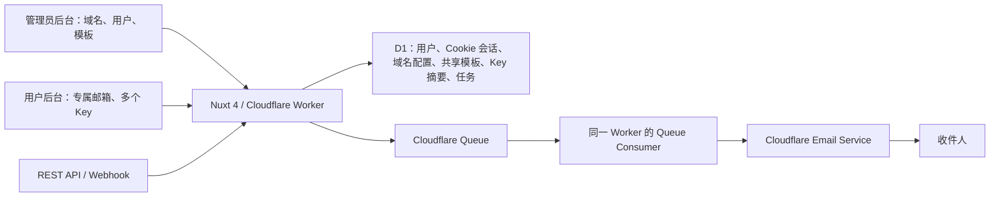

# CloudMail Platform

基于 Nuxt 4、Nuxt UI、Cloudflare Workers、Email Service、D1 与 Queues 的事务型邮件发送平台。

平台面向以下场景：

- 在后台同步 Cloudflare 账户中的 Zone 与 Email Sending 状态
- 维护一套由所有发送域名和邮箱共享的 HTML 模板，并支持导入完整 `.html` 文件
- 为每个发送域名配置固定模板变量，例如登录、支持或品牌链接
- 通过 REST API、模板 Webhook 或后台表单触发发送
- 管理员创建普通用户，并为每个用户分配唯一的专属发件邮箱
- 每个用户创建多个独立、可撤销的 API Key
- 用户后台与用户 Key 都只能使用该用户关联的发件邮箱
- 使用 `Idempotency-Key` 防止调用方重复提交
- 通过 Queue 异步发送、自动重试并将状态写入 D1
- 查看发送任务、Cloudflare Message ID、错误与审计日志

> Cloudflare Email Service 仅适合事务型邮件，例如验证码、订单通知、密码重置和系统告警。营销群发、订阅简报和冷邮件不属于本项目用途。

## 深入文档

- [全链路逻辑、首次部署初始化、后期发送过程与成本估算](docs/architecture-initialization-sending-cost.md)

## 技术架构



HTTP 请求只负责验证权限、渲染模板、创建 D1 任务并写入 Queue，成功时返回 `202 Accepted`。Queue Consumer 调用 `env.EMAIL.send()`，因此外部调用不会被 SMTP 投递延迟阻塞。

## 项目目录

```text
app/                 Nuxt UI 管理后台
server/api/auth/     管理员/用户登录、Cookie 会话、注销
server/api/admin/    用户、域名、模板、密钥、Webhook、日志、手动发送
server/api/account/  普通用户的模板、多个 Key、日志与手动发送
server/api/v1/       对外 REST 与 Webhook API
server/utils/        鉴权、Cloudflare 域名同步、任务入队
server/plugins/      Nitro Queue Consumer 注册
shared/              前后端共用类型与安全模板编译器
migrations/          D1 migrations
tests/               模板安全与凭据处理测试
nuxt.config.ts       Worker、D1、Queue、Email Service bindings 生成配置
```

## Cloudflare 资源

项目没有仓库级 `wrangler.jsonc`。`nuxt.config.ts` 使用可移植默认值，由
Nitro 生成临时的 `.output/server/wrangler.json`。首次部署时 Wrangler 会
自动创建并绑定缺少的 D1、发送 Queue 和 dead-letter Queue；已有绑定会被复用。
生成配置包含：

| Binding | 类型 | 用途 |
| --- | --- | --- |
| `DB` | D1 | 管理员、用户、Cookie 会话、域名配置、共享模板、Key 摘要、任务与日志 |
| `EMAIL_QUEUE` | Queue producer | 接收异步邮件任务 |
| Queue consumer | Queue consumer | 消费任务并调用 Email Service |
| `EMAIL` | `send_email` | 发送事务型邮件 |
| `ASSETS` | Static Assets | Nuxt 客户端资源 |

## 从零初始化与首次部署

> 当前仓库已经完成 Cloudflare 资源创建和生产绑定。下面的步骤用于在新的 Cloudflare 账户、复制出的新项目或资源被重建时初始化；不要在现有生产账户中重复创建同名资源。

### 1. 准备环境

需要：

- Node.js 22
- pnpm 11
- 一个已启用 Workers、D1、Queues 和 Email Service 的 Cloudflare 账户
- 一个由 Cloudflare 托管 DNS 的发送域名
- Wrangler 已登录目标账户

```bash
pnpm install
pnpm exec wrangler --version
pnpm exec wrangler whoami
```

本项目使用 Wrangler 4。`whoami` 显示的账户必须与准备部署的 Cloudflare 账户一致。

### 2. Cloudflare 自动创建 D1 与 Queue

正常情况下不需要提前创建资源，也不需要保存 Account ID、D1 UUID 或 Queue
名称。首次运行 `pnpm run deploy:cloudflare` 时：

1. Wrangler 检查 `DB`、`EMAIL_QUEUE` 和 Queue consumer bindings。
2. 缺少 D1 时自动创建并绑定 `<Worker 名称>-db`。
3. 缺少发送队列时自动创建并绑定 `<Worker 名称>-send`。
4. 缺少 dead-letter Queue 时自动创建 `<Worker 名称>-dead-letter`。
5. Worker 部署成功后自动执行所有尚未应用的 D1 migrations。
6. 最后查询关键业务表，确认 D1 已完成结构初始化。

已有 Worker 的 bindings 会继续复用，不会因为生成配置中没有资源 ID 而重建。

### 3. 最简完整构建配置

如果目标 Worker 就叫 `cloudflare-email-platform`，使用默认资源名称时，
**Build Variables 完全留空**。Cloudflare Workers Builds 只需要：

| 设置 | 值 |
| --- | --- |
| Production branch | `main` |
| Build command | `pnpm run build` |
| Deploy command | `pnpm run deploy:cloudflare` |
| Root directory | `/` |
| Build Variables | 留空 |

只有以下情况才需要添加可选变量：

| 变量 | 何时需要 | 默认值 |
| --- | --- | --- |
| `CF_WORKER_NAME` | Dashboard 中的 Worker 不是默认名称时；该值必须与 Worker 名称一致 | `cloudflare-email-platform` |
| `CF_D1_DATABASE_NAME` | 第一次部署时希望使用自定义 D1 名称 | `<Worker 名称>-db` |

`APP_NAME` 已固定为 `CloudMail Platform`，不再需要配置。Cookie 默认有效期为
8 小时；只有需要覆盖时，才在 Worker 的运行时 Variables 中设置
`SESSION_TTL_SECONDS`，不要把它当作构建变量。

`SETUP_TOKEN` 与 `CF_API_TOKEN` 仍然是 Worker 加密运行时 Secret，不能放入
Build Variables、`.env` 或 Git。

### 4. 接入发送域名

发送地址所属域名必须先接入 Cloudflare Email Sending：

```bash
pnpm exec wrangler email sending enable example.com
pnpm exec wrangler email sending list example.com
```

也可以在 Cloudflare Dashboard 的 **Compute → Email Service → Email Sending → Onboard Domain** 中操作。Cloudflare 会配置发送所需的 SPF、DKIM、DMARC 和退信相关 DNS 记录；域名未显示为启用前不要发送生产邮件。

### 5. 本地构建与类型检查

```bash
pnpm build
pnpm cf:types
pnpm db:migrate:local
```

- `pnpm build` 由 Nitro 生成临时 Wrangler 部署配置。
- 本地迁移写入 Wrangler 的本地 D1 数据目录。
- Cloudflare 的 Deploy command 会在部署后自动应用远程 migrations，不需要再
  单独运行 `pnpm db:migrate:remote`。
- 默认英文 HTML 模板会在管理员初始化以及域名同步时幂等补充到共享模板库，不会覆盖已有同名模板。

### 6. 检查并交给 Cloudflare 部署

```bash
pnpm test
pnpm lint
pnpm typecheck
pnpm build
pnpm exec wrangler deploy --dry-run --config .output/server/wrangler.json
git push origin main
```

`--dry-run` 只验证产物和 bindings，不上传 Worker。正式版本一律由 Cloudflare
Workers Builds 在收到 `main` 推送后执行 `pnpm run deploy:cloudflare`，不从
开发电脑上传。

Cloudflare 部署完成后检查 Worker：

```bash
curl --fail-with-body https://YOUR_WORKER/api/health
```

### 7. 配置生产 Secret 并创建管理员

先在密码管理器中生成并保存一个至少 32 个随机字符的 `SETUP_TOKEN`。
可以在 Worker 的 **Settings → Variables and Secrets** 中添加加密 Secret，
也可以在完成构建后通过 Wrangler 的交互式输入设置：

```bash
pnpm exec wrangler secret put SETUP_TOKEN
```

打开 `https://YOUR_WORKER/setup`，输入同一个 `SETUP_TOKEN`，再设置管理员用户名和至少 12 位的密码。管理员创建成功后，初始化接口会因为 D1 中已经存在管理员而自动关闭。

如果需要在后台读取 Cloudflare Zone 与 Email Sending 状态，再创建一个只读
Cloudflare API Token，资源范围限制到目标账户，并交互式写入：

```bash
pnpm exec wrangler secret put CF_API_TOKEN
```

所需权限：

- `Zone Read`
- `Email Sending Read`

域名同步不再需要 `CF_ACCOUNT_ID`；Token 的资源范围决定平台能看见哪些 Zone。
平台自身发送邮件不使用这个 Token，而是使用 `EMAIL` binding。

确认管理员可以登录且域名同步成功后，可以删除临时初始化 Secret：

```bash
pnpm exec wrangler secret delete SETUP_TOKEN
```

### 8. 配置 Cloudflare Workers Builds

本项目不使用 `.github` 和 GitHub Actions。自动构建部署由 Cloudflare Workers Builds 完成：

1. 在 Cloudflare Dashboard 打开目标 Worker。
2. 进入 **Settings → Builds → Connect**。
3. 选择 GitHub 仓库和生产分支。
4. 使用以下配置：

| 设置 | 值 |
| --- | --- |
| Production branch | `main` |
| Build command | `pnpm run build` |
| Deploy command | `pnpm run deploy:cloudflare` |
| Root directory | `/` |
| Non-production branch builds | Disabled |

默认名称部署不需要 Build Variables。连接后，每次向 `main` 推送提交都会由
Cloudflare 安装依赖、执行 Nuxt 构建、自动补齐 bindings、部署 Worker、应用
D1 migrations 并验证数据库结构。不同 Cloudflare Worker 可以连接同一仓库；
非默认名称的 Worker 只需设置自己的 `CF_WORKER_NAME`，即可自动创建独立 D1
和 Queue。

Nuxt 的 `cloudflare-module` 会生成最终 Worker 入口和 Wrangler 部署配置，
队列消费者通过 `server/plugins/email-queue.ts` 注册到 `cloudflare:queue`
Hook。`pnpm run build` 会校验 D1/Queue/Email 草稿 bindings 和最终产物中的
消费者；Deploy command 再校验真实远程 D1 及 migrations。任何一步失败都会
让 Cloudflare Build 标记为失败。

## 本地开发

```bash
pnpm install
cp .env.example .env
pnpm build
pnpm cf:types
pnpm db:migrate:local
cp .dev.vars.example .dev.vars
pnpm worker:dev
```

默认配置不需要 `.env`；只有测试非默认 Worker 名称或自定义资源时才复制
`.env.example`。把仅用于本地测试的 `SETUP_TOKEN` 和可选 `CF_API_TOKEN`
写入 `.dev.vars`。两个文件都已被 `.gitignore` 排除。

`pnpm dev` 只启动普通 Nuxt 开发服务器，没有真实的 D1、Queue 和 Email binding。需要验证 Cloudflare binding 时请使用 `pnpm worker:dev`。本地测试真实邮件前应使用自己控制的收件地址，并确认 `send_email` 的远程绑定配置符合当前 Cloudflare 文档。

## 生产 Secrets

项目不会把任何 API Token、管理员密码或 Webhook Secret 写入源码。

### `SETUP_TOKEN`

首次创建管理员时需要。请先在密码管理器中生成并保存随机值，再通过交互式输入写入：

```bash
pnpm exec wrangler secret put SETUP_TOKEN
```

打开部署地址的 `/setup`，输入相同的初始化令牌并创建管理员。管理员创建成功后 `/setup` 会自动关闭。密码使用带随机盐的 PBKDF2-SHA-256 保存，D1 不保存明文。

初始化完成后可以删除该 Secret：

```bash
pnpm exec wrangler secret delete SETUP_TOKEN
```

## 登录 Cookie 与 Nuxt 水合

浏览器端不保存登录 Token，也不使用 `localStorage`。登录成功后，后端直接签发：

- `HttpOnly`
- `Secure`
- `SameSite=Strict`
- `Path=/`
- 默认 8 小时有效期

的 `cloudmail_session` Cookie。D1 只保存 Cookie 随机值的 SHA-256 摘要。

Nuxt SSR 使用请求级 `useRequestFetch()` 把浏览器 Cookie 转发给 `/api/auth/me`，在服务端解析当前账户、角色、绑定域名和发件邮箱，并写入 Nuxt `useState`。该状态随 Nuxt payload 水合到客户端，因此刷新页面不会先显示错误身份，也无需把敏感凭据暴露给前端 JavaScript。所有管理与发送 API 仍会在后端重新校验 Cookie，前端状态不是授权依据。

### `CF_API_TOKEN`

后台点击“从 Cloudflare 同步”时需要。该 Token 只用于读取其资源范围内的
Zone 和 Email Sending 域名；Worker 内访问 D1、Queue 和 Email Service 仍
使用原生 bindings。

建议创建专用的最小权限 Token，并限制到目标账户：

- `Zone Read`
- `Email Sending Read`

设置：

```bash
pnpm exec wrangler secret put CF_API_TOKEN
```

如果没有设置该 Secret，可以使用迁移或部署脚本预先写入域名，平台其他功能不受影响。

## 域名接入

发送域名必须先在 Cloudflare Email Service 中完成 SPF、DKIM 与 Return-Path 配置：

```bash
pnpm exec wrangler email sending enable example.com
pnpm exec wrangler email sending list
```

也可以在 Cloudflare Dashboard 的 **Compute & AI → Email Service → Email Sending** 中接入。

平台会显示账户内所有活动 Zone，但只允许从 `sending_enabled = true` 的域名创建真实投递任务。每个域名可以单独设置：

- 默认发件地址本地部分，例如 `noreply`
- 默认发件人显示名
- 默认 `Reply-To`
- `config` 命名空间中的固定模板变量
- 绑定该域名的 API Key 与 Webhook

## 用户、邮箱与多 Key 权限模型

管理员在“用户与邮箱”页面创建普通用户，并分配：

- 登录用户名与初始密码
- 一个已启用 Email Sending 的域名
- 唯一邮箱前缀，例如 `alice@yourdomain.com`
- 可选发件人显示名

普通用户登录后可以使用平台共享模板库中的已启用模板，但发送域名和发件地址仍由账户锁定。用户只能看到自己的发送日志和自己的 Key；后台手动发送会强制使用用户的专属邮箱。

同一用户可以按环境或调用方创建多个 Key，例如 `Production`、`Staging`、`Partner A`。每个 Key 可以单独撤销。Key 记录同时绑定 `user_id` 与 `domain_id`；REST 请求不会接受自定义发件地址，后端会从用户记录重新计算发件邮箱。管理员创建的域名级 Key 不绑定用户，适合受信任的平台级集成。

停用用户或重置密码会清除该用户的全部登录会话；停用用户后，其所有 Key 也会立即因用户状态校验而失效。

## HTML 模板

模板编辑和写入 API 只接受 HTML，也可以直接导入 `.html` / `.htm` 文件。换行请使用 `<p>`、`<div>` 或 `<br>` 等 HTML 元素，不要把 JSON 字符串里的 `\n` 直接粘贴为正文。

首次初始化管理员、以及以后从 Cloudflare 同步域名时，平台会向共享模板库幂等补充以下英文 HTML 模板。每个 Template Key 只保存一份，供全部域名和邮箱使用；已有同名 Key 的模板不会被覆盖：

| Template Key | English template | Variables |
| --- | --- | --- |
| `email_verification_code` | Email verification code | `user.name`, `verification.code`, `verification.expires_minutes` |
| `welcome_registration` | Welcome registration | `app.name`, `user.name`, `action.url` |
| `sign_in_code` | Sign-in code | `user.name`, `verification.code`, `verification.expires_minutes` |
| `password_reset` | Password reset | `user.name`, `action.url`, `security.expires_minutes` |
| `password_changed` | Password changed | `user.name`, `security.changed_at`, `security.ip_address` |
| `account_invitation` | Account invitation | `app.name`, `user.name`, `inviter.name`, `action.url` |

这些默认模板的名称、说明、主题和 HTML 正文均为英文。模板编辑器只维护 HTML 正文；发送时平台会从最终 HTML 自动生成纯文本备用正文。

变量使用：

```text
{{user.name}}
{{order.id}}
{{config.links.login}}
```

变量在插入 HTML 之前会进行 HTML 转义，不支持未转义的三花括号语法。后台预览使用没有脚本权限的 sandbox iframe，并通过 CSP 禁止远程资源与表单提交。

每个域名都可以在“域名管理 → 模板固定变量”中保存 JSON，例如：

```json
{
  "links": {
    "home": "https://example.com",
    "login": "https://example.com/login",
    "support": "https://example.com/support"
  }
}
```

模板通过 `{{config.links.login}}` 等路径读取这些值。发送时服务端会根据实际发送域名注入完整的 `config` 对象；REST、Webhook 和手动发送提交的变量都不能覆盖该命名空间。因此同一份 HTML 模板可以服务全部邮箱，同时为不同域名使用不同固定链接。

旧版 Markdown 模板仍可读取；管理员首次打开时会转换为 HTML，保存后完成永久迁移。历史模板中被保存为字面量的 `\n` / `\r\n` 也会在编译和数据库迁移时规范化。

每封邮件始终包含：

- HTML 正文
- 从最终 HTML 自动生成的纯文本正文
- 主题
- 发件地址与显示名
- 可选 `Reply-To`
- 可选优先级

## REST API

管理员可以创建域名级 API Key；普通用户也可以创建多个用户 Key。完整 Key 仅显示一次，D1 只保存 SHA-256 摘要。用户 Key 发出的邮件始终使用该用户绑定的邮箱，请求不能传入或覆盖 `From`。

### 请求

```text
POST https://YOUR_WORKER/api/v1/send
Authorization: Bearer ${CLOUDMAIL_API_KEY}
Content-Type: application/json
Idempotency-Key: YOUR_STABLE_BUSINESS_EVENT_ID
```

`Authorization` 必须使用完整 Key，不是后台列表里用于识别的 Key 前缀。Key 只能放在受控的服务端环境变量或 Secret 中，不能放入浏览器代码、公开仓库、URL 或客户端日志。

`Idempotency-Key` 建议使用稳定的业务事件标识，例如 `verification-user-10001`。同一次业务事件发生网络超时或 `503` 时，使用原值重试；不要为每次重试生成新值。

### cURL 示例

```bash
curl --request POST 'https://YOUR_WORKER/api/v1/send' \
  --header "Authorization: Bearer ${CLOUDMAIL_API_KEY}" \
  --header 'Content-Type: application/json' \
  --header 'Idempotency-Key: verification-user-10001' \
  --data '{
    "template_key": "email_verification_code",
    "to": ["recipient@example.com"],
    "cc": [],
    "bcc": [],
    "variables": {
      "user": { "name": "Example User" },
      "verification": {
        "code": "483921",
        "expires_minutes": 10
      }
    },
    "priority": "normal"
  }'
```

### Node.js / TypeScript 示例

```ts
const response = await fetch('https://YOUR_WORKER/api/v1/send', {
  method: 'POST',
  headers: {
    Authorization: `Bearer ${process.env.CLOUDMAIL_API_KEY}`,
    'Content-Type': 'application/json',
    'Idempotency-Key': 'verification-user-10001'
  },
  body: JSON.stringify({
    template_key: 'email_verification_code',
    to: ['recipient@example.com'],
    variables: {
      user: { name: 'Example User' },
      verification: {
        code: '483921',
        expires_minutes: 10
      }
    },
    priority: 'normal'
  })
})

const result = await response.json()
if (!response.ok) {
  throw new Error(result.message || `Email request failed: ${response.status}`)
}

console.log(result.jobId, result.status, result.duplicate)
```

### JSON 字段

| 字段 | 是否必填 | 说明 |
| --- | --- | --- |
| `template_key` | 条件必填 | 共享模板库中的模板 Key。也可改用 `template_id`，二者提供一个即可 |
| `template_id` | 条件必填 | 模板 ID；与 `template_key` 二选一 |
| `to` | 必填 | 一个邮箱字符串或邮箱数组，至少 1 个地址 |
| `cc` | 可选 | 一个邮箱字符串或邮箱数组，默认空数组 |
| `bcc` | 可选 | 一个邮箱字符串或邮箱数组，默认空数组 |
| `variables` | 可选 | 替换模板中的 `{{variable.path}}`；最多 100 个顶层字段，总 JSON 大小不超过 100 KB；`config` 由平台注入，调用方不能覆盖 |
| `priority` | 可选 | `low`、`normal` 或 `high`，默认 `normal` |
| `idempotency_key` | 可选 | 也可用 `Idempotency-Key` 请求头提供，长度 8–200 个字符 |

To、Cc、Bcc 合计最多 50 个去重后的地址。外部 REST 调用只能使用状态为 `active` 的共享模板；Key 继续决定实际发送域名和发件邮箱。

### 响应与错误

新任务成功进入 Queue 时返回 `202 Accepted`：

```json
{
  "jobId": "5ef7b7ef-0a99-4cea-aa65-e503e62e9be9",
  "status": "queued",
  "duplicate": false
}
```

相同 API Key 与相同 `Idempotency-Key` 的重复请求不会创建第二个任务，会以 `200 OK` 返回原来的 `jobId`，并把 `duplicate` 设为 `true`。

| HTTP 状态 | 含义 |
| --- | --- |
| `200` | 幂等重复请求，返回已经存在的任务 |
| `202` | 新任务已进入 Cloudflare Queue |
| `400` | JSON、邮箱、模板字段或幂等键无效 |
| `401` | Key 缺失、错误、已撤销，或其关联用户已停用 |
| `404` | 共享模板库中找不到指定模板 |
| `409` | 模板未启用或域名尚未启用 Email Sending |
| `413` | 模板变量 JSON 超过 100 KB |
| `503` | 暂时无法写入 Queue；可以使用同一幂等键重试 |

API 返回 `queued` 代表平台已经接收任务，不代表收件服务器已经投递成功。最终状态、Cloudflare Message ID 和失败原因可在发送日志页面查看。

### Key 管理建议

- Production、Staging 和每个外部调用方分别创建 Key。
- Key 疑似泄漏时立即撤销并创建新 Key，不要继续复用。
- 重试同一业务事件时复用 `Idempotency-Key`。
- 不要在浏览器、移动端、公开环境变量或前端构建产物中使用 Key。
- 停用用户会使该用户的全部 Key 立即失效；撤销单个 Key 不影响同一用户的其他 Key。

## Webhook

后台将 Webhook 固定绑定到一个已启用模板。触发时只需提供收件人与变量：

```bash
curl -X POST "https://YOUR_WORKER/api/v1/webhooks/WEBHOOK_ID" \
  -H "X-Webhook-Secret: whsec_REPLACE_ME" \
  -H "Content-Type: application/json" \
  -H "Idempotency-Key: event-10001" \
  -d '{
    "to": "customer@example.com",
    "variables": {
      "user": { "name": "Example User" },
      "request": { "id": "REQ-10001" }
    }
  }'
```

Webhook ID 不是凭据；真正的凭据是 `X-Webhook-Secret`。Secret 只显示一次并以摘要形式保存。

## 数据库迁移与部署

```bash
pnpm db:migrate:local
pnpm test
pnpm lint
pnpm typecheck
pnpm build
pnpm exec wrangler deploy --dry-run --config .output/server/wrangler.json

pnpm db:migrate:remote
git push origin main
```

`db:migrate:remote` 只更新 D1 schema；Worker 上传仍由 Cloudflare Workers
Builds 完成。部署后检查：

```bash
curl https://YOUR_WORKER/api/health
pnpm exec wrangler tail YOUR_WORKER_NAME
```

## 可靠性说明

- Queue 提供至少一次投递；API 幂等键负责防止调用方重复提交。
- Consumer 使用 D1 状态抢占防止同一 Queue 消息并发执行。
- Email Service 成功但 D1 最终状态写入失败的极端情况下，Queue 重试仍可能造成重复邮件。对严格“恰好一次”的业务，应在邮件内容中使用业务幂等标识，并让下游接受重复通知。
- 任务最多尝试 3 次，之后进入 `failed`，同时由 Cloudflare Queue 投递到 dead-letter queue。
- 登录连续失败 5 次会在 15 分钟窗口内限流。
- 普通用户的 Cookie、手动发送、日志和 API Key 都按 `user_id` 隔离。
- 用户 Key 同时校验用户状态、用户域名和专属邮箱；撤销 Key 或停用用户后立即失效。
- 管理员接口在后端强制要求 `role = admin`，普通用户不能通过直接调用绕过页面限制。

## 部署隔离

本仓库不包含 Cloudflare Account ID、D1 ID、生产域名、Worker URL 或任何现有
资源绑定。部署前请在自己的 Cloudflare 账户中完成认证，并通过
`CF_WORKER_NAME` 和可选的 `CF_D1_DATABASE_NAME` 设置独立资源名称。

项目生成的部署配置只声明通用的 `DB`、`EMAIL_QUEUE` 和 `EMAIL` binding；首次
部署时 Wrangler 会在当前已认证账户中创建或绑定资源。请为生产、测试和开发
使用不同的 Worker 名称，避免环境之间共享 D1 或 Queue。

## 平台限制

以 Cloudflare 官方文档为准：

- To、Cc、Bcc 合计最多 50 个收件人
- 普通收件地址整封邮件最多 5 MiB
- 已验证目标地址整封邮件最多 25 MiB
- 自定义 Headers 合计最多 16 KB

本项目当前聚焦 HTML 模板正文发送，不开放外部附件上传。需要附件时建议先上传到 R2，再在受控的后端流程中读取并加入 `EmailAttachment`，不要把任意大文件写入 D1。

相关官方文档：

- [Cloudflare Email Service Workers API](https://developers.cloudflare.com/email-service/api/send-emails/workers-api/)
- [Email Service limits](https://developers.cloudflare.com/email-service/platform/limits/)
- [Configure sending domains](https://developers.cloudflare.com/email-service/configuration/domains/)
- [Cloudflare Queues delivery guarantees](https://developers.cloudflare.com/queues/reference/delivery-guarantees/)

## License

MIT
