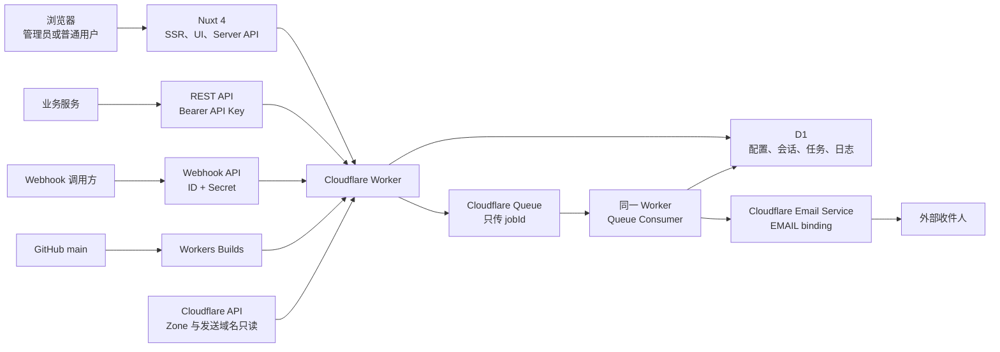
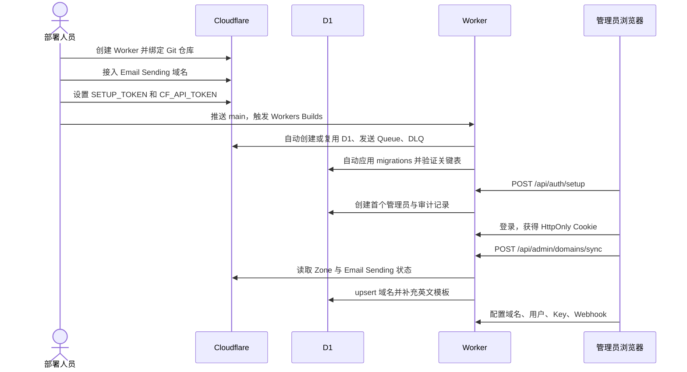
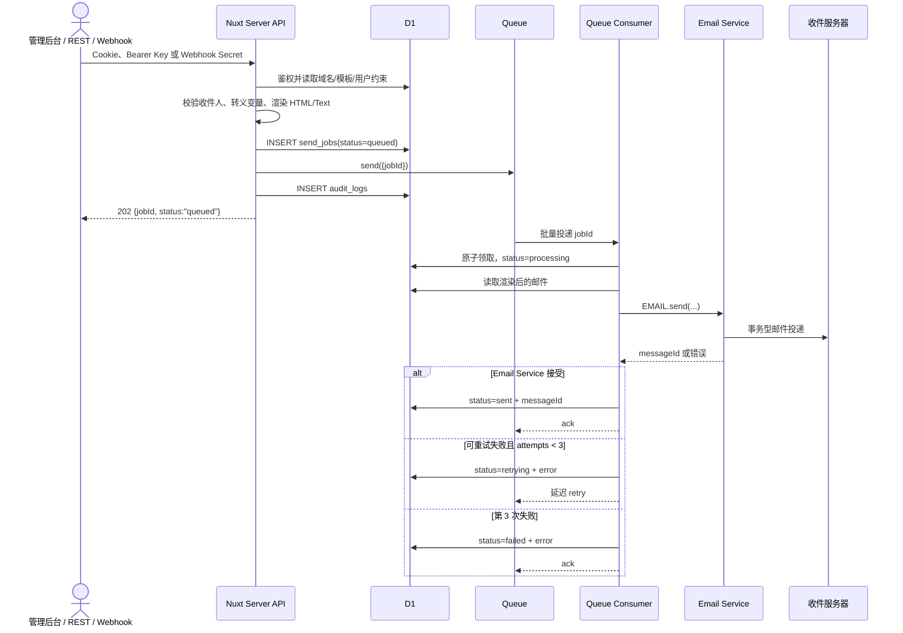

# CloudMail Platform 全链路逻辑、初始化与成本估算

> 文档基于当前仓库实现与 Cloudflare 2026-07-28 官方公开价格编写。金额均为美元、按月、未含税，不包含域名注册费和同一 Cloudflare 账户中其他项目产生的用量。

## 1. 一句话理解这个平台

CloudMail Platform 是一个部署在 Cloudflare Worker 上的事务型邮件发送平台：

1. Nuxt 4 同时提供管理界面和服务端 API。
2. D1 保存账户、Cookie 会话、域名、模板、Key 摘要、Webhook、发送任务和审计记录。
3. HTTP API 只完成鉴权、模板渲染、任务落库和入队，正常返回 `202 Accepted`。
4. Cloudflare Queue 异步消费任务。
5. Queue Consumer 通过 `EMAIL` binding 调用 Cloudflare Email Service。
6. 发送结果、Cloudflare Message ID 或错误重新写回 D1。

平台用于验证码、欢迎注册、密码重置、订单通知、系统告警等事务邮件，不应用于营销群发、订阅简报或冷邮件。

## 2. 整体架构



### 2.1 各组件的责任

| 组件 | 责任 | 不负责的事情 |
| --- | --- | --- |
| Nuxt 4 / Nuxt UI | 管理后台、SSR 登录状态、服务端 API | 不直接连接 SMTP |
| Worker Fetch Handler | 承接网页和 API 请求 | 不等待最终邮件投递完成 |
| D1 | 持久化用户、会话、域名、模板、Key 摘要、任务和审计 | 不发送邮件 |
| Queue | 解耦 API 和实际发送，提供重试与死信能力 | 不保存完整 HTML，队列消息只有 `jobId` |
| Queue Consumer | 领取任务、调用 Email Service、更新状态 | 不接受外部业务请求 |
| Email Service | 接受并投递邮件，返回 Message ID | 不管理本平台的用户或模板权限 |
| Workers Builds | `main` 推送后构建、部署、自动供应资源并执行 migration | 不创建首个管理员 |
| Cloudflare API Token | 后台同步 Zone 和 Email Sending 状态 | 不用于邮件发送 |

## 3. 第一次部署与初始化

初始化分为两层：

- **基础设施初始化**：Cloudflare 资源、binding、数据库 migration、Secret 和 Worker 部署。
- **业务初始化**：创建第一个管理员、同步发送域名、生成默认模板、配置用户和调用凭据。

### 3.1 前置条件

需要准备：

- Workers Paid 计划。向任意外部地址发送邮件需要 Paid 计划。
- 一个由 Cloudflare 托管 DNS 的域名。
- 该域名已完成 Cloudflare Email Sending 接入。
- Node.js 22、pnpm 11 和 Wrangler 4。
- GitHub 私有仓库，以及 Cloudflare Workers Builds 对该仓库的访问权。

### 3.2 自动供应 Cloudflare 资源

仓库不保存账户专属的 `wrangler.jsonc`，也不要求提前创建 D1 或 Queue。
`nuxt.config.ts` 由 Nitro 生成临时 `.output/server/wrangler.json`，其中的
草稿 bindings 交给 Wrangler 自动供应：

| 资源 | 默认结果 |
| --- | --- |
| Worker | `cloudflare-email-platform` |
| D1 `DB` | `cloudflare-email-platform-db` |
| Queue `EMAIL_QUEUE` | `cloudflare-email-platform-send` |
| dead-letter Queue | `cloudflare-email-platform-dead-letter` |

如果 Dashboard 中的 Worker 就使用默认名称，Build Variables 可以完全留空。
只有 Worker 名称不同才必须设置：

| 可选 Build Variable | 用途 |
| --- | --- |
| `CF_WORKER_NAME` | 覆盖 Worker 名称，必须与 Dashboard 项目名称一致 |
| `CF_D1_DATABASE_NAME` | 第一次部署时覆盖自动创建的 D1 名称 |

项目不接受 D1 ID、Queue 名称或 Account ID 作为普通构建变量。D1 与 Queue
均由 Worker 名称推导并由 Wrangler 自动创建或继承。`APP_NAME` 已固定为
`CloudMail Platform`；会话默认 8 小时，只有需要覆盖时才在 Worker 运行时
设置 `SESSION_TTL_SECONDS`。

项目不使用 Nuxt `$env` 分支。Wrangler 在部署时检查远程 bindings：缺少就
创建，已存在就继续复用。自动供应的资源 ID 不需要写回 Git。

当前 Worker 使用的 binding 是：

| Binding | 类型 | 当前用途 |
| --- | --- | --- |
| `DB` | D1 | 全部持久化业务数据 |
| `EMAIL_QUEUE` | Queue producer | 写入 `{ "jobId": "..." }` |
| Queue consumer | Queue consumer | 批量读取任务，最大批次 10 |
| `EMAIL` | Email Sending binding | 调用 `env.EMAIL.send()` |
| `ASSETS` | Workers Static Assets | Nuxt 前端资源 |

发送域名必须先启用：

```bash
pnpm exec wrangler email sending enable example.com
pnpm exec wrangler email sending list example.com
```

Cloudflare 会为发送域名配置或要求配置 SPF、DKIM、DMARC 和 Return-Path 等记录。平台自己的“同步域名”只读取配置状态，不会替代 Email Sending 的域名接入。

### 3.3 自动应用并验证 D1 migration

Cloudflare Workers Builds 使用：

```text
Build command:  pnpm run build
Deploy command: pnpm run deploy:cloudflare
```

Deploy command 的顺序是：

1. `wrangler deploy` 创建或复用 D1/Queue bindings 并部署 Worker。
2. `wrangler d1 migrations apply DB --remote` 读取 `d1_migrations`，只应用
   尚未执行的 migration。
3. 查询 `d1_migrations`、`admins`、`app_users`、`domains` 和 `send_jobs`，
   任何关键表缺失都会使 Cloudflare Build 失败。

Migration 按顺序创建：

1. 管理员、管理员会话和登录尝试表。
2. 域名、模板、API Key、Webhook、发送任务和审计表。
3. 普通用户、用户会话，以及用户与域名、专属发件邮箱、Key、任务之间的关联。
4. 英文默认模板定义表，并处理历史模板的换行和 HTML 迁移。
5. 把按域名重复的模板合并成共享模板，并为域名增加固定模板配置。

这一步只创建结构和默认模板定义，不会自动读取 Cloudflare 账户中的域名，也
不会创建管理员。数据库 schema 的“初始化”和业务管理员的“初始化”是两件事。

### 3.4 配置 Secret

需要至少配置一次性的 `SETUP_TOKEN`：

```bash
pnpm exec wrangler secret put SETUP_TOKEN
```

建议使用密码管理器生成至少 32 个随机字符。Secret 通过 Worker 的
**Settings → Variables and Secrets** 或 Wrangler 交互式输入配置，不能放进
Build Variables、`.env`、生成的 Wrangler 配置或 Git。

如果要在管理后台同步 Cloudflare 域名，再配置只读 Token：

```bash
pnpm exec wrangler secret put CF_API_TOKEN
```

两个 Secret 的职责完全不同：

| Secret | 用途 | 何时可以删除 |
| --- | --- | --- |
| `SETUP_TOKEN` | 授权创建第一个管理员 | 首个管理员创建并验证登录后 |
| `CF_API_TOKEN` | 读取账户 Zone 和 Email Sending 域名状态 | 不再需要后台同步时 |

`CF_API_TOKEN` 只需要 `Zone Read` 与 `Email Sending Read`，并应把资源范围
限制到目标账户。域名同步由 Token 的资源范围决定可见 Zone，不再需要
`CF_ACCOUNT_ID`。

发送邮件不使用 `CF_API_TOKEN`，而是使用 Worker 的原生 `EMAIL` binding。

### 3.5 构建并部署 Worker

首次部署前执行：

```bash
pnpm install
pnpm test
pnpm lint
pnpm typecheck
pnpm build
pnpm exec wrangler deploy --dry-run --config .output/server/wrangler.json
git push origin main
```

Nuxt 的 `cloudflare-module` 会生成最终 Worker 入口和部署配置：

- HTTP 请求由生成入口交给 Nuxt/Nitro。
- `server/plugins/email-queue.ts` 注册 `cloudflare:queue` Hook，消费发送队列并调用 `processEmailQueueJob()`。
- `pnpm build` 会检查 D1/Queue/Email 草稿 bindings 和最终 `.output` 中的
  真实消费者；配置缺失或消费者未被打包时构建会直接失败。
- `pnpm run deploy:cloudflare` 会补齐远程资源、应用 migration 并验证 D1
  关键表；无需人工再运行远程 migration。

`--dry-run` 不上传 Worker。正式上传由 Cloudflare Workers Builds 在收到
`main` 推送后执行，开发电脑不运行 `wrangler deploy`。

部署成功后先检查：

```bash
curl --fail-with-body https://YOUR_WORKER/api/health
```

### 3.6 创建第一个管理员

打开：

```text
https://YOUR_WORKER/setup
```

初始化接口的真实处理顺序是：

1. 检查生产环境是否存在 `SETUP_TOKEN`。
2. 对用户提交的 Token 做常量时间摘要比较。
3. 查询 `admins`，只有管理员数量为 `0` 时允许继续。
4. 向共享模板库幂等补充默认英文模板。
5. 使用 PBKDF2-SHA-256、随机盐和 100,000 次迭代散列管理员密码。
6. 写入管理员和 `admin.bootstrap` 审计记录。
7. 以后再次调用初始化接口会返回冲突，入口自动关闭。

这一步不依赖域名是否已经同步；全新数据库也会创建六个共享模板。后续域名同步会再次执行幂等检查，但不会生成按域名重复的副本。

确认管理员可以登录后删除临时 Token：

```bash
pnpm exec wrangler secret delete SETUP_TOKEN
```

### 3.7 登录 Cookie 与 SSR 水合

管理员和普通用户使用同一个登录入口。登录成功后：

1. 后端验证 D1 中的 PBKDF2 密码摘要。
2. 生成带 `cms_` 前缀的 32 字节随机会话值。
3. D1 只保存会话值的 SHA-256 摘要和过期时间。
4. 后端签发 `cloudmail_session` Cookie：
   - `HttpOnly`
   - HTTPS 下 `Secure`
   - `SameSite=Strict`
   - `Path=/`
   - 默认 8 小时有效
5. Nuxt SSR 在服务端请求 `/api/auth/me`，把浏览器 Cookie 随请求转发。
6. 服务端读取账户、角色、绑定域名和专属发件邮箱，并通过 Nuxt payload 水合到客户端。

因此刷新页面时不会先显示“未登录”再跳成用户状态，浏览器 JavaScript 也拿不到 Cookie 原值。前端水合状态只用于显示；每一个敏感 API 都会在后端重新验证 Cookie。

### 3.8 同步 Cloudflare 域名

管理员点击“从 Cloudflare 同步”后：

1. 后端用 `CF_API_TOKEN` 分页读取该 Token 资源范围内的所有活动 Zone。
2. 对每个 Zone 读取 Email Sending 子域名及启用状态。
3. 先把 D1 中旧域名标为 `missing` 且禁用发送。
4. 再按域名名称 upsert 最新状态。
5. 确认共享模板库包含六个英文 HTML 模板。
6. 写入 `domains.sync` 审计记录。

默认模板包括：

- Email verification code
- Welcome registration
- Sign-in code
- Password reset
- Password changed
- Account invitation

模板只在共享库中对应 `template_key` 不存在时创建，不会覆盖管理员已经修改过的同名模板。

同步使用 `per_page=50` 并根据 `result_info.total_pages` 自动翻页，不再受单页
50 个 Zone 限制。

### 3.9 完成业务配置

管理员接下来依次完成：

1. 为域名配置默认发件邮箱前缀、显示名、可选 `Reply-To` 和固定模板变量。
2. 编辑或新建平台共享 HTML 模板，并启用模板。
3. 创建普通用户，把用户绑定到一个已启用发送的域名和唯一邮箱前缀。
4. 由管理员或用户创建多个 API Key。
5. 按需要创建绑定到固定模板的 Webhook。

API Key 和 Webhook Secret 只显示一次。D1 只保存 SHA-256 摘要和可识别前缀，无法从数据库恢复原始值。

### 3.10 绑定 Git 自动部署

Cloudflare Workers Builds 连接 GitHub 私有仓库后，使用：

| 设置 | 值 |
| --- | --- |
| Production branch | `main` |
| Build command | `pnpm run build` |
| Deploy command | `pnpm run deploy:cloudflare` |
| Root directory | `/` |
| Non-production branch builds | Disabled |

使用默认 Worker 名称的环境不需要 Build Variables。多个 Worker 连接同一仓库
时，只需为非默认项目设置各自的 `CF_WORKER_NAME`，即可派生并自动创建独立 D1
和 Queue。以后 `main` 的每次推送会自动构建、部署、执行 D1 migration 并验证
schema。

### 3.11 初始化时序图



## 4. 后期发送邮件的完整过程

平台有三种入口，但最终都会进入同一个 `createEmailJob()` 和同一条 Queue。

### 4.1 三种发送入口

| 入口 | 鉴权 | 模板选择 | From 规则 |
| --- | --- | --- | --- |
| 管理后台手动发送 | `cloudmail_session` Cookie | 管理员可使用草稿；普通用户只能使用 active 模板 | 管理员用模板/域名默认值；普通用户强制使用专属邮箱 |
| REST `POST /api/v1/send` | `Authorization: Bearer cmp_live_...` | 调用方传共享库中的 `template_key` 或 `template_id` | 用户 Key 强制使用专属邮箱；域名 Key 使用模板/域名默认值 |
| Webhook `POST /api/v1/webhooks/:id` | Webhook ID + `X-Webhook-Secret` | 创建 Webhook 时已经固定 active 模板 | 使用绑定模板/域名默认值 |

### 4.2 鉴权和权限收敛

REST Key 请求：

1. 读取完整 Bearer Key。
2. 对 Key 做 SHA-256。
3. 在 D1 中查找未撤销的 `secret_hash`。
4. 如果 Key 绑定用户，再验证用户仍为 active、用户域名仍与 Key 域名一致。
5. 更新 `last_used_at`。

Webhook 请求：

1. URL 中的 ID 定位 Webhook。
2. `X-Webhook-Secret` 做 SHA-256 后与 D1 摘要匹配。
3. 只接受 active Webhook。
4. 模板 ID 由后端从 Webhook 记录中取得，调用方不能替换。

Cookie、Key 或前端状态都不能改变普通用户的域名和发件邮箱。后端会从 D1 重新解析最终 From，不接受外部请求传入 `from`。

### 4.3 校验收件人与变量

进入任务创建后会：

1. 接受 `to`、`cc`、`bcc` 的单个字符串或数组。
2. 全部转为小写并跨三个字段去重。
3. 要求 To 至少 1 个地址。
4. 限制 To、Cc、Bcc 合计最多 50 个唯一地址。
5. 模板变量最多 100 个顶层字段，总 JSON 不超过 100 KB。
6. 要求提供 `template_key` 或 `template_id`。
7. 在共享模板库中解析模板。
8. 验证域名仍启用了 Email Sending。
9. 外部 REST 和 Webhook 只允许 active 模板；管理员手动发送可使用草稿。
10. 根据发送域名加载固定配置，并以 `config` 命名空间覆盖请求中的同名字段。

### 4.4 渲染 HTML 邮件

模板编译器会：

1. 把主题中的 `{{variable.path}}` 替换为单行文本。
2. 把发送域名的固定配置注入 `config` 命名空间，调用方不能覆盖。
3. 把 HTML 中的变量值做 HTML 转义后替换，避免变量注入标签或脚本。
4. 得到最终 HTML。
5. 从最终 HTML 自动生成纯文本备用正文。
6. 解析模板、域名或用户约束后的 From、显示名和 Reply-To。

平台写入发送任务的是**已经渲染完成**的主题、HTML 和纯文本。即使之后修改模板，已排队任务也不会变化。

### 4.5 幂等、落库和入队

生成任务时：

1. 创建 UUID `jobId`。
2. 在 `send_jobs` 插入一条 `queued` 记录。
3. D1 唯一索引约束 `(source_ref, idempotency_key)`。
4. 把仅包含 `{ jobId }` 的小消息写入 `EMAIL_QUEUE`。
5. 写入 `email.enqueue` 审计记录。
6. 新任务返回 `202 Accepted`。

同一个 Key 或 Webhook 使用相同 `Idempotency-Key` 重复提交时，后端返回原任务 ID 和 `duplicate: true`，不再创建或入队新任务。不同 Key 即使使用相同幂等值也互不冲突，因为 `source_ref` 不同。

`202` 只代表任务成功进入异步流程，不代表收件服务器已经接受邮件。最终状态必须看任务日志和 Message ID。

如果 D1 插入成功、但 Queue 写入失败，任务会被标为 `failed` 并返回 `503`。当前实现中相同幂等键会继续指向这条失败任务，不会自动重新入队；运维人员需要确认失败原因后重新创建任务，或在后续版本增加显式“重新入队”能力。

### 4.6 Queue Consumer 实际发送

Queue Consumer 收到 `jobId` 后：

1. 原子地把 `queued` / `retrying` 任务更新为 `processing`。
2. `attempts + 1`，记录 `started_at`。
3. 如果任务处于 `processing` 超过 15 分钟，允许重新领取，避免 Worker 中断后永久卡死。
4. 从 D1 读取已渲染的收件人、From、Reply-To、主题、HTML、纯文本和优先级。
5. 把 `high` / `low` 转成 `Importance` 与 `X-Priority` 邮件头。
6. 添加 `X-CloudMail-Job-ID` 便于关联排查。
7. 调用 `env.EMAIL.send()`。
8. 成功后把任务更新为 `sent`，保存 Cloudflare `messageId` 和 `sent_at`。
9. 失败后保存错误码和截断后的错误信息。

发送异常最多实际尝试 3 次：

- 第 1 次失败：状态变成 `retrying`，约 30 秒后重试。
- 第 2 次失败：状态仍为 `retrying`，约 60 秒后重试。
- 第 3 次失败：状态变成 `failed`，消息被确认，不再重试。

Nitro 生成的 Wrangler 配置同时定义最多 3 次 Queue 重试和死信队列。可预期
的 Email Service 发送异常已经由业务代码捕获，因此会在第 3 次后正常确认；
死信队列主要承接未被业务代码处理的消费者异常，例如 D1 操作持续抛错或
Worker 执行异常。

### 4.7 发送时序图



### 4.8 状态含义

| 状态 | 含义 | 是否可以视为成功 |
| --- | --- | --- |
| `queued` | D1 已创建任务，等待 Queue Consumer | 否 |
| `processing` | Consumer 已领取并正在调用 Email Service | 否 |
| `retrying` | 上一次发送失败，等待延迟重试 | 否 |
| `sent` | Email Service 已接受，D1 保存了 Message ID | 是“已由服务接受”，不等同于用户一定已阅读 |
| `failed` | 入队失败或三次发送尝试均失败 | 否 |

### 4.9 一致性边界

当前设计提供的是“任务创建幂等 + Queue 至少一次处理”，不是端到端严格 exactly-once：

- `Idempotency-Key` 能避免同一调用方重复创建任务。
- D1 的领取更新能阻止同一个正常任务被并发消费。
- 如果 Email Service 已接受邮件，但 Worker 在写回 `sent` 前中断，15 分钟后任务可能被再次领取，理论上存在重复投递窗口。

验证码、订单通知等调用方应继续使用稳定的业务幂等键；高价值场景还应让邮件内容包含业务事件 ID，并监控同一 `X-CloudMail-Job-ID` 的异常重复。

## 5. 权限模型

### 5.1 管理员

管理员可以：

- 同步账户域名。
- 配置所有发送域名。
- 创建、编辑和启停模板。
- 创建普通用户并分配唯一发件邮箱。
- 创建域名级 Key 或用户级 Key。
- 创建固定模板 Webhook。
- 手动发送并查看全局日志。

### 5.2 普通用户

普通用户只能：

- 使用管理员分配的域名和唯一发件邮箱。
- 查看和使用平台共享库中的 active 模板。
- 使用自己的邮箱手动发送。
- 创建和撤销自己的多个 API Key。
- 查看自己的发送任务。

停用用户后，登录鉴权会拒绝该用户；用户 Key 也会因为每次鉴权都检查用户 active 状态而立即失效。

### 5.3 域名级 Key 与用户级 Key

| Key 类型 | 创建者 | From | 适用场景 |
| --- | --- | --- | --- |
| 域名级 Key | 管理员 | 模板或域名默认发件地址 | 受信任的平台级服务 |
| 用户级 Key | 管理员或该用户 | 强制为用户专属邮箱 | 租户、成员、业务线隔离 |

所有 Key 都可以独立撤销，完整 Key 只显示一次。

## 6. 可靠性和运维关注点

### 6.1 当前已有措施

- API 与实际投递异步解耦。
- D1 先落任务，再发送。
- 每个调用方支持幂等键。
- Queue 发送失败会写入任务状态。
- 消费者有延迟重试和陈旧任务重新领取。
- 记录 Cloudflare Message ID、错误和审计日志。
- Worker 日志和 trace 已开启；trace 抽样率为 10%。

### 6.2 建议监控

至少监控：

- `queued` 超过 5 分钟的任务数量。
- `processing` 超过 15 分钟的任务数量。
- `retrying` 和 `failed` 比例。
- Email Service hard bounce、suppression 和 daily quota。
- Queue backlog、consumer error 和 DLQ 消息。
- D1 存储量与每月写入量。
- Workers CPU、请求、日志和构建分钟。

### 6.3 当前数据保留风险

`send_jobs` 会永久保存每封邮件渲染后的完整 HTML 和纯文本，目前没有自动清理任务。成本估算假定 D1 活跃数据始终低于 5 GB。

例如平均每条任务仅正文 25 KB：

- 20,000 条约为 500 MB 原始正文；
- 还要加上纯文本、收件人、索引和其他字段；
- 如果每月持续发送且不清理，存储会逐月累积。

建议增加 90 天或 180 天保留策略：先保留业务需要的主题、状态、Message ID 和审计字段，再删除或归档历史正文。超过 D1 包含的 5 GB 后，额外存储按官方价格计费。

## 7. 成本模型

### 7.1 估算假设

下表按以下口径计算：

- 数量是**每月成功提交给 Email Service 的邮件数**。
- 每个任务只有 1 个外部收件人，没有 Cc/Bcc。
- 每封是普通小型 HTML 事务邮件，无附件。
- 不包含发送失败重试导致的额外 Email Service 接受次数。
- Queue 消息只有 `jobId`，小于 64 KB。
- D1 总存储低于 5 GB。
- 同一账户的 Workers 请求、CPU、Queue、D1、日志和构建用量没有被其他项目大量占用。
- 按 Cloudflare 公布的账户级月度包含量计算。

如果一封任务包含多个 To/Cc/Bcc，Cloudflare 公开定价页没有在该页面明确说明多收件人如何折算计费邮件数，因此不能直接用“任务数”等同于“计费邮件数”。生产账单应以 Email Service Analytics 中的 billed outbound emails 为准。

### 7.2 Cloudflare 官方价格

截至 2026-07-27：

| 服务 | Workers Paid 包含量 | 超出价格 |
| --- | --- | --- |
| Workers 计划 | 账户最低 $5/月 | 基础计划，不按本项目单独重复收取 |
| Email Sending | 3,000 封/月/账户 | $0.35 / 1,000 封 |
| Worker 请求 | 10,000,000 次/月 | $0.30 / 1,000,000 次 |
| Worker CPU | 30,000,000 CPU ms/月 | $0.02 / 1,000,000 CPU ms |
| Queues | 1,000,000 operations/月 | $0.40 / 1,000,000 operations |
| D1 读取 | 25,000,000,000 rows/月 | $0.001 / 1,000,000 rows |
| D1 写入 | 50,000,000 rows/月 | $1.00 / 1,000,000 rows |
| D1 存储 | 5 GB | $0.75 / GB-month |
| Workers Logs | 20,000,000 log events/月 | $0.60 / 1,000,000 events |
| Workers Builds | 6,000 build minutes/月 | $0.005 / minute |

Email Sending 发送到任意外部地址必须使用 Workers Paid。3,000 封包含量按 Cloudflare 账户、按账单月共享；已被 Email Service 接受的邮件和 hard bounce 会计费，在 API 边界直接拒绝或被 suppression list 拦截的请求不计入。发送到账号内 verified destination addresses 免费且不占月度额度。

### 7.3 指定发送量的月成本

计算公式：

```text
Email Sending 超额费
= max(月计费邮件数 - 3,000, 0) / 1,000 × $0.35

新建独立 Paid 账户的估算总额
= $5.00 Workers Paid 基础费 + Email Sending 超额费
```

| 月发送量 | 超出 3,000 的数量 | Email Sending 超额费 | Worker/Queue/D1 等超额费 | 独立账户估算总额 | 已有 Paid 计划时的增量 |
| ---: | ---: | ---: | ---: | ---: | ---: |
| 1,000 | 0 | $0.00 | $0.00 | **$5.00/月** | **$0.00/月** |
| 5,000 | 2,000 | $0.70 | $0.00 | **$5.70/月** | **$0.70/月** |
| 10,000 | 7,000 | $2.45 | $0.00 | **$7.45/月** | **$2.45/月** |
| 20,000 | 17,000 | $5.95 | $0.00 | **$10.95/月** | **$5.95/月** |

“已有 Paid 计划时的增量”假定账户本来就支付 $5/月，而且 3,000 封邮件包含量没有被其他项目使用。Cloudflare 的包含量按账户共享，不是每个 Worker 各有一份。

### 7.4 为什么其他组件在这四档中估算为 $0 超额

#### Queue

Cloudflare 普通 Queue 消息通常是 1 次 write、1 次 read、1 次 delete，即 3 operations：

| 月发送量 | 预计 Queue operations | 1,000,000 包含量占比 |
| ---: | ---: | ---: |
| 1,000 | 3,000 | 0.3% |
| 5,000 | 15,000 | 1.5% |
| 10,000 | 30,000 | 3.0% |
| 20,000 | 60,000 | 6.0% |

即使 20,000 封全部正常投递，也远低于每月 1,000,000 operations。重试会增加 read 次数，但距离包含量仍很大。

#### Worker 请求和 CPU

保守按每封邮件不超过 2 次动态 Worker 调用估算：

- 1 次 HTTP 创建任务；
- 最多再按 1 次 Queue Consumer invocation 计入。

20,000 封约不超过 40,000 次调用，只占 10,000,000 次包含请求的 0.4%。实际 Consumer 最大批次为 10，调用数通常更低。模板渲染、D1 查询和邮件 API 调用也属于轻量逻辑，正常情况下不会接近 30,000,000 CPU ms。

#### D1

一封成功的 REST、Webhook 或手动邮件通常产生大约 5 个应用层写入动作：

1. 更新 Key/Webhook 最后使用时间，或更新 Cookie 会话最后访问时间。
2. 插入 `send_jobs`。
3. 插入 `audit_logs`。
4. Consumer 领取任务并更新为 `processing`。
5. 更新为 `sent`。

20,000 封大约是 100,000 次行级写入量级，只占每月 50,000,000 rows written 包含量约 0.2%。实际计费按 D1 扫描和写入的行数，不是简单按 SQL 条数，因此应以 Cloudflare D1 Analytics 为准。

#### Workers Builds

构建分钟与邮件量无关，只与 Git 推送和部署次数有关。Paid 计划每月包含 6,000 分钟；正常项目发布频率下不会因 1,000 到 20,000 封邮件产生额外构建费。

### 7.5 会让实际账单变化的因素

- 同一 Cloudflare 账户已有其他 Worker、Queue、D1 或 Email Service 用量。
- 一封任务包含多个收件人。
- 大量 hard bounce 仍会消耗 Email Sending 配额。
- Worker 在 Email Service 接受后、D1 写回前中断，极端情况下可能重复接受和计费。
- 大型 HTML 或长期不清理历史正文造成 D1 超过 5 GB。
- 高频 Git 推送消耗超过 6,000 build minutes。
- 异常流量、泄漏的 API Key 或 Webhook Secret 造成非预期发送。
- 税费、信用卡换汇和 Cloudflare 后续价格调整。

### 7.6 20,000 封/月的容量提醒

20,000 封/月平均约 667 封/日，但验证码或活动通知通常不是均匀发送。Cloudflare 新账户的每日发送额度比较保守，会根据发送行为、送达率和账户状态逐步调整。

因此“月度费用可以支持 20,000 封”不等于“新账户第一天可以瞬间发送 20,000 封”。上线前应：

1. 在 Email Service Dashboard 查看当前 daily sending limit。
2. 逐步预热发送域名和业务流量。
3. 控制 bounce 和 suppression。
4. 如果业务会突发，提前向 Cloudflare 申请提升额度。

## 8. 官方资料

- [Cloudflare Email Service Pricing](https://developers.cloudflare.com/email-service/platform/pricing/)
- [Cloudflare Email Service Limits](https://developers.cloudflare.com/email-service/platform/limits/)
- [Cloudflare Workers Pricing](https://developers.cloudflare.com/workers/platform/pricing/)
- [Cloudflare D1 Pricing](https://developers.cloudflare.com/d1/platform/pricing/)
- [Cloudflare Workers Builds Limits and Pricing](https://developers.cloudflare.com/workers/ci-cd/builds/limits-and-pricing/)
